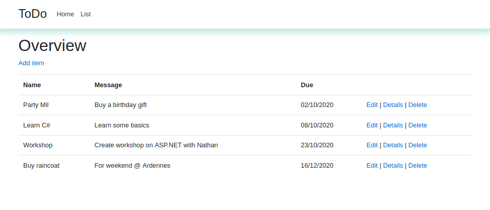
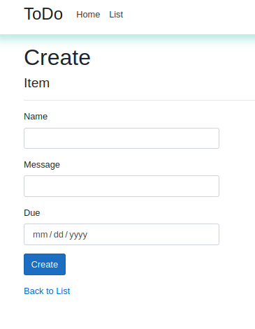

# ASP.NET - ToDo List

Creating a simple web app in ASP.NET Core, a CRUD app to make a To do list.

### Learning objectives
  - To make a simple application in ASP.NET Core
  - To be able to connect to a database (migrations & scaffolding)
  - To be able to make a simple Create, Read, Update & Delete (CRUD) application
  - To work with Razor pages and add some styling.
  
Homepage:

View of the list:  

Create:

